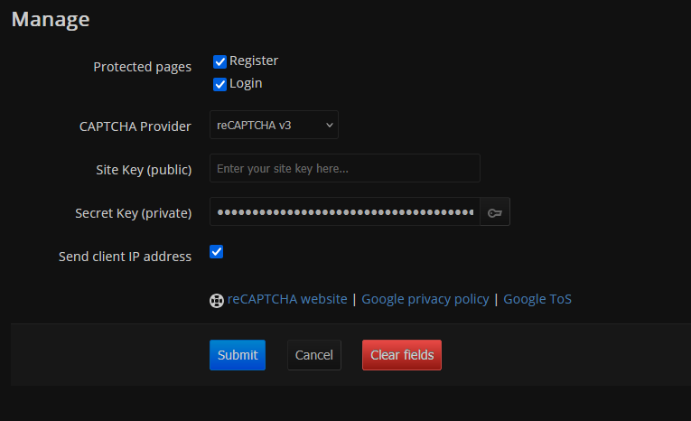

# Form Captcha extension

Protect register/login forms with captcha

Currently the following CAPTCHA providers are supported:
* [Cloudflare Turnstile](https://www.cloudflare.com/application-services/products/turnstile/)
* [reCAPTCHA v2/v3](https://developers.google.com/recaptcha)
* [hCaptcha](https://www.hcaptcha.com/)

The extension is especially useful if you're running a public instance and want to protect it from bots.
To see failed captcha solve attempts, look at the logs in: `data/users/_/log.txt` (admin log)

---

Warning: if you're protecting the login page and you have unsafe autologin enabled, it can allow anyone to bypass the captcha - it's recommended to disable this option

---

Available configuration settings:
* Protected pages
* CAPTCHA provider
* Site Key
* Secret Key
* Send client IP address?

Show configuration screenshot

## Trouble with login

If you are having trouble with logging in after configuring the extension, you can manually disable it in `FreshRSS/data/config.php`, login and reconfigure the extension.

## Changelog

* 1.0.1 [2025-??-??]
	* Improvements
		* The user is now notified that the extension must be enabled for the configuration view to work properly. (due to JS)
	* Security
		* Captcha configuration now requires reauthenticating in FreshRSS to protect the secret key
		* Register form wasn't correctly protected because the extension wasn't protecting the POST action, only displaying the captcha widget
		* Fixed potential captcha bypass due to checking for `POST_TO_GET` parameter in the session
		* Use slightly stronger CSP on login and register pages
	* Bug fixes
		* Fixed wrong quote in CSP `"` instead of `'`
		* Client IP is now taken from `X-Real-IP` instead of `X-Forwarded-For`, since the latter could contain multiple comma-separated IPs
	* Refactor
		* `data-auto-leave-validation` is now being used in the configure view instead of `data-leave-validation`
		* `data-toggle` attributes were removed from the configure view, since they aren't needed anymore as of v1.27.1
		* Other minor changes
* 1.0.0 [2025-07-30]
	* Initial release
