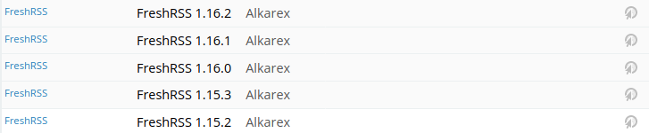

# CustomCSS extension

A FreshRSS extension which give ability to create user-specific CSS rules to apply in addition of the actual theme.

To use it, upload this directory in your `./extensions` directory and enable it on the extension panel in FreshRSS. You can add CSS rules by clicking on the manage button.

## Changelog

- 0.2 added file permission check, added german translation, removed un-editable file static/style.css
- 0.1 initial version

## Examples

### Enhancing mobile view

The following CSS rules let you have a more comfortable mobile view by hiding some icons (read/unread article, mark as favorite and RSS feed's favicon) and by reducing text size. It also displays the name of the subscribed feed, instead of the favicon:

```css
@media (max-width: 840px) 
{
	.flux_header .item.website
	{
		width:20%;
		padding:3px;
	}

	.flux .website .favicon, .flux_header .item.manage
	{
		display:none;
	}
	
	
	.flux_header .item.website span
	{
		display:inline;
		font-size:0.7rem;
	}
}
```

The result is shown below:

Desktop screen resolution:


Mobile screen resolution:

                          
